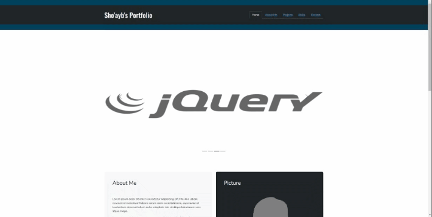

# Bootstrap-Portfolio

## Description

This project involved creating a mockup of a portfolio website using Bootstrap v5. The intention is to get familiarised with Bootstrap components to build responsive webpages.

## Achievement

This portfolio is now fully responsive and includes a Bootstrap Jumbotron that includes a carousel that link to various language documentation used within frontend development, an about me section, project section featuring Bootstrap cards and skills section using Bootstrap table layout.

## GIF Screenshot of Portfolio

## Link to deployed site

